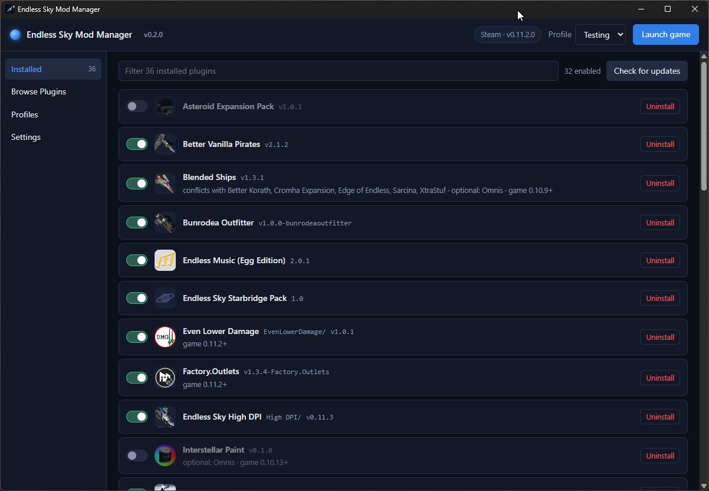
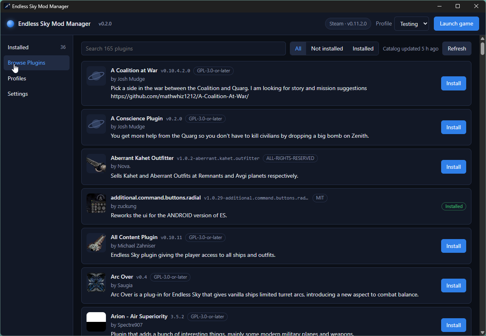
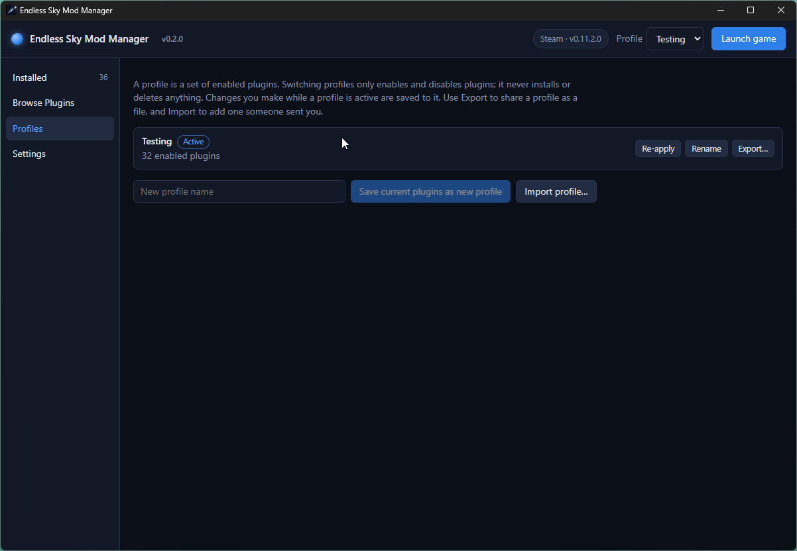
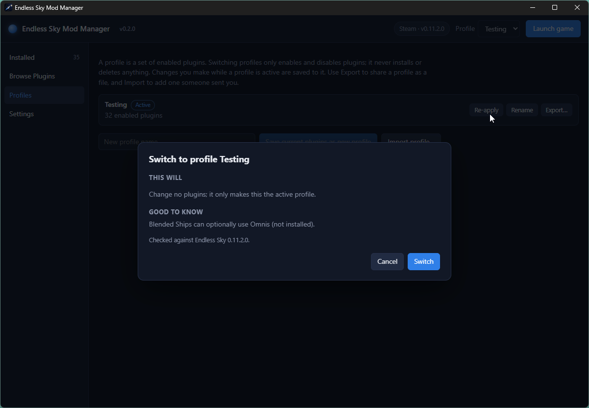
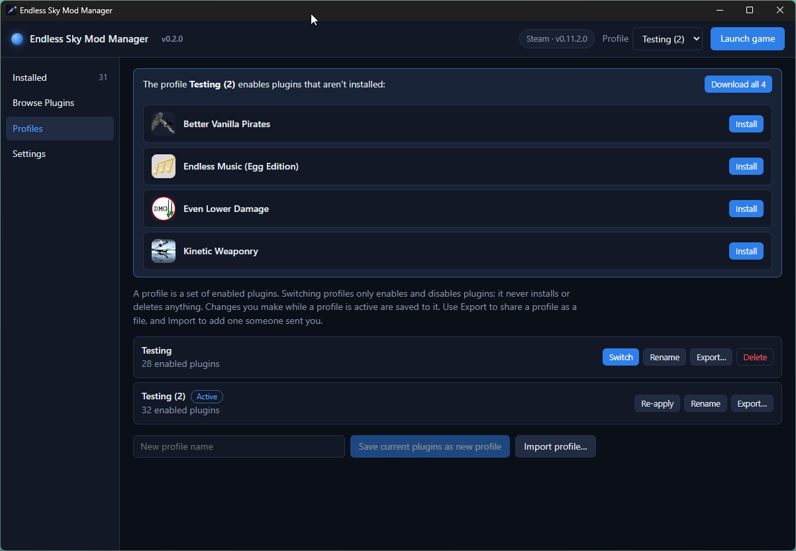
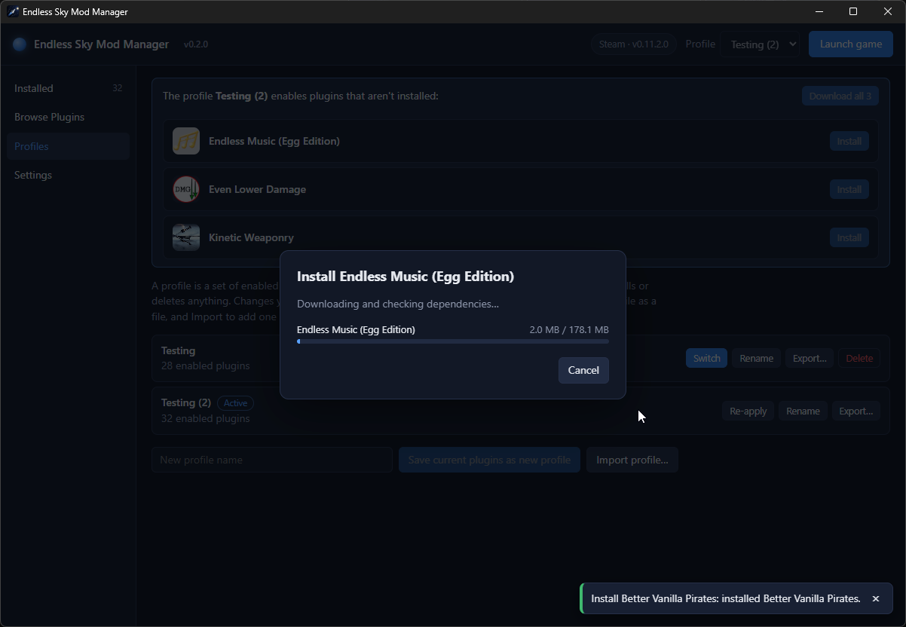

<p align="center">
  
</p>

<h1 align="center">Endless Sky Mod Manager</h1>


[](https://github.com/TheComerator/Endless-Sky-Modman/actions/workflows/ci.yml)

**Install, update and switch *Endless Sky* plugins without unzipping anything.**

**[⬇ Download the latest version](https://github.com/TheComerator/Endless-Sky-Modman/releases/latest)** for Windows, macOS or Linux (details under [Install](#install)).

A small desktop app that browses the official community plugin catalog and manages the plugins in your game for you, in the spirit of r2modman. It checks that plugins work together *before* it changes anything, keeps separate profiles for different playthroughs, and never touches your game while it's running.

> This is an unofficial community tool, not made by or affiliated with the *Endless Sky* developers. It's an early release. It works on a real Steam install and the core logic is well tested, but it hasn't had many eyes on it yet. Bug reports are very welcome, see [Reporting a problem](#reporting-a-problem).

## Screenshots









Import someone's shared profile and the manager lists the plugins you're missing, ready to install in one click:





## What it does

- **Browse and search** the live official plugin catalog, with each plugin's description, author, version and license.
- **One-click install**, including any plugins it requires, which are found and installed automatically.
- **Updates**, one at a time or all at once. If a new version needs an extra plugin, that is installed too.
- **Enable and disable** plugins without uninstalling them.
- **Profiles**: save different sets of enabled plugins (a vanilla run, a heavy-mods run) and switch between them. If you toggle something in-game, the manager notices and offers to keep or restore your profile.
- **Conflict and dependency checks** before every change, in plain language. If two plugins conflict, it offers to disable one instead of just refusing.
- **Finds your game** whether it's from Steam (including Steam as a Flatpak), a standalone install, an AppImage, or a custom folder, and launches it for you.

It does **not** manage the game itself (versions, multiple builds). If you want that, see [ESLauncher2](#how-it-differs-from-eslauncher2).

## Install

Download the installer for your system from the [latest release](https://github.com/TheComerator/Endless-Sky-Modman/releases/latest).

| System | Download | Notes |
|---|---|---|
| **Windows** | `…-setup.exe` (recommended) or `.msi` | The `.exe` installs for your user only, with no admin prompt. The `.msi` is mainly for managed or corporate PCs. |
| **macOS** | `.dmg` (Apple Silicon Macs only) | Needs one extra step on first open, see below. |
| **Linux** | `.AppImage`, `.deb` or `.rpm` | Detection logic is tested; the packaged app is lightly tested. |

**The installers are not code-signed yet.** Windows SmartScreen may say "Windows protected your PC" on first launch: click **More info → Run anyway**. On macOS the first launch may say the app is "damaged and can't be opened". It isn't: that's how macOS reports any app that isn't signed with a paid Apple certificate. Drag the app into Applications, then run this once in Terminal and open it again:

```bash
xattr -cr "/Applications/Endless Sky Mod Manager.app"
```

(If the `.dmg` itself won't open, run `xattr -cr` on the downloaded `.dmg` file first.) This is expected for a new unsigned app (the installer's own update-signing is separate and already in place), and code signing is planned (see the [launch plan](docs/launch/next-steps.md)). If you'd rather not run an unsigned installer, you can [build it from source](#building-from-source).

## First run

1. Open the app. It looks for Endless Sky automatically and shows what it found in the top bar. If it finds nothing, add your game folder under **Settings**.
2. Open **Browse**, pick a plugin, and click **Install**. A short review shows exactly what will happen before anything is written.
3. Use the switches on the **Installed** page to turn plugins on and off, and **Launch game** to play.

Plugins you installed by hand before are picked up too. They show as **Unmanaged**: you can still enable, disable or remove them, and the manager never deletes anything without telling you.

## Is it safe?

The manager is careful because it edits files your game reads:

- It **won't change anything while Endless Sky is running**, because the game rewrites its plugin list when it closes and would undo the change.
- It **backs up `plugins.txt`** before every write (`plugins.txt.esmm-bak` next to it) and writes atomically, so a crash can't leave a half-written file.
- Downloads are **HTTPS only**, size-limited, and unzipped with protection against archives that try to write outside their folder.
- Every change is **shown first and committed together**; a plugin is never left half-installed.
- The plugin list and update checks use the same official catalog the game's own plugin page uses. The only other thing the app contacts is GitHub, once at startup, to ask whether a newer version of the manager exists (it never installs anything without your click, and you can turn the check off under **Settings → Updates**). There is no telemetry and nothing about you or your plugins is sent anywhere.
- **Updates to the manager itself** are only accepted if they're signed with this project's own key, so a tampered download is rejected.

## How it differs from ESLauncher2

[ESLauncher2](https://github.com/EndlessSkyCommunity/ESLauncher2) is an excellent, actively maintained launcher that manages *the game itself*: installing builds and versions, running several side by side. Plugin handling is one feature among many. This project is the opposite: it does one thing, plugins, and goes deeper on it (dependency and conflict checking, profiles, update tracking). They fit together fine, and you can use both.

## Where things live

| What | Where (Windows) |
|---|---|
| Your plugins | `%APPDATA%\endless-sky\plugins\` (the game's own folder) |
| The game's plugin on/off list | `%APPDATA%\endless-sky\plugins.txt` |
| The manager's records and profiles | `%APPDATA%\io.github.thecomerator.esmm\` |
| Catalog cache and log files | `%LOCALAPPDATA%\io.github.thecomerator.esmm\` (logs in `logs\`, kept 14 days) |

On Linux and macOS the same pieces live in the platform's standard data, cache and log folders under the same app name.

## Reporting a problem

Please [open an issue](https://github.com/TheComerator/Endless-Sky-Modman/issues/new/choose). The form asks what you were doing and for the relevant part of the log. The log is the single most useful thing you can include: see the table above for where it is.

Questions, ideas and plugin-author feedback are welcome too. See [CONTRIBUTING.md](CONTRIBUTING.md).

## Building from source

You need [Rust](https://rustup.rs/) (stable), [Node.js](https://nodejs.org/) 20 or newer, and the [Tauri prerequisites](https://tauri.app/start/prerequisites/) for your system (on Windows: the MSVC build tools and WebView2).

```bash
cd app
npm install
npm run tauri dev      # run it
npm run tauri build    # make installers
```

Run the tests from the repository root with `cargo test -p esmm-core` (the logic) and from `app/` with `npm test` (the UI helpers). See [CONTRIBUTING.md](CONTRIBUTING.md) for the full checklist.

## Project status

v1 is feature-complete: everything above works and has been verified on a real Windows + Steam install. The remaining open item is a design review of a few inferred choices ([`project-memory/architecture-review.md`](project-memory/architecture-review.md)). What's planned next is in [`docs/launch/next-steps.md`](docs/launch/next-steps.md). The detailed engineering record, including the reasoning behind each decision, is in [`CLAUDE.md`](CLAUDE.md).

## License

[MIT](LICENSE). *Endless Sky* is a separate project by its own community, licensed under the GPL-3.0; this tool contains none of its code.
